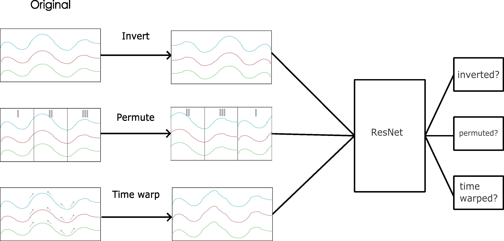
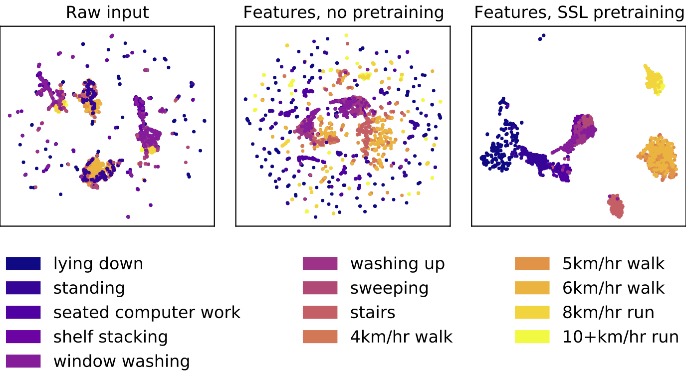
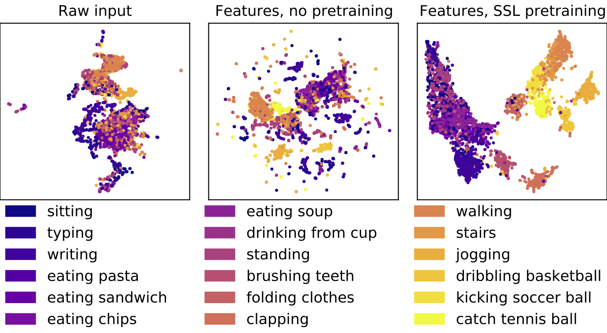

# Multi-task self-supervised learning for wearables

This repository is the official implementation of [Self-supervised learning for Human Activity Recognition Using 700,000 Person-days of Wearable Data](TODO).




## Use the pre-trained models
Required:
* Python 3.7+
* Torch 1.7+

```python
import torch
import numpy as np

repo = 'OxWearables/ssl-wearables'
harnet10 = torch.hub.load(repo, 'harnet10', class_num=5, pretrained=True)
x = np.random.rand(1, 3, 300)
x = torch.FloatTensor(x)
harnet10(x)

harnet30 = torch.hub.load(repo, 'harnet30', class_num=5, pretrained=True)
x = np.random.rand(1, 3, 900)
x = torch.FloatTensor(x)
harnet30(x)
```
This is an example of a five-class prediction for both 10-second and 30-second long examples.
The assumed sampling rate is 30Hz.

## Requirements
If you would like to develop the model for your own use, you need to follow the instructions below:
### Installation 
```bash
conda create -n ssl_env python=3.7
conda activate ssl_env
pip install -r req.txt
```


### Directory structure
To run the models, the data directory will have to be structured in a similar fashion as below. The `ADL` dataset has been included 
as an example. 
```shell
- data: 
  |_ downstream 
    |_oppo
      |_ X.npy
      |_ Y.npy
      |_ pid.npy
    |_pamap2
    ...
    
  |_ ssl # ignore the ssl folder if you don't wish to pre-train using your own dataset
    |_ ssl_capture_24
      |_data
        |_ train
          |_ *.npy
          |_ file_list.csv # containing the paths to all the files
        |_ test
          |_ *.npy
      |_ logs
        |_models
```


## Training
### Self-supervised learning
First you will want to download the processed capture24 dataset on your local machine. Self-supervised training on capture-24 for all of the three tasks can be run using:
```bash
python mtl.py runtime.gpu=0 data.data_root=PATH2DATA runtime.is_epoch_data=True data=ssl_capture_24 task=all task.scale=false augmentation=all   model=resnet data.batch_subject_num=5 dataloader=ten_sec 
```
It would then save the model trained into `PATH2DATA/logs/models`. 

## Fine-tuning
You will need to specify your benchmark datasets using the config files under `conf/data` directory. 
All the specified models will be evaluated sequentially.
```bash
python downstream_task_evaluation.py data=custom_10s report_root=PATH2REPORT evaluation.flip_net_path=PATH2WEIGHT data.data_root=PATH2DATA is_dist=True evaluation=all 
```
Change the path of the full model to obtain different results. An example `ADL` dataset has already been included in the
`data` folder.  The weight path is the path to the model file in `model_check_point`. `report_root` can be
anything where on your machine.

## Pre-trained Models
You can download pretrained models here:

| Dataset   |   Subject count | Arrow of Time | Permutation | Time-warp |  Link | 
| ------------------ |---------------- | -------------- |---------------- |  --- | ---| 
|  UK-Biobank   |  100k | ☑️  |  ☑️  |   ☑️  | [Download](https://drive.google.com/file/d/1Pm4oGPCM4gKLZEHjv8dAuzhOSLdTzcRN/view?usp=sharing) | 
|  UK-Biobank   |  1k | ❌  | ☑️ |     ☑️️  | [Download](https://drive.google.com/file/d/1HYAIdKB-uAlSU0wvj8tEaflRvyVlUnZ9/view?usp=sharing) | 
|  UK-Biobank   |  1k |  ☑️   |❌ |  ☑️  | [Download](https://drive.google.com/file/d/1aG8BqUTCnDGqKFZbzd19zr8GP1qMs52s/view?usp=sharing) | 
|  UK-Biobank   |  1k |   ☑️ | ☑️  |   ❌  | [Download](https://drive.google.com/file/d/1wYQM9GviQSbaTMhmg5GCNDpH2RTscEGj/view?usp=sharing) | 
|  Capture-24   |  ~150 | ☑️  |  ☑️  |   ☑️  | [Download](https://drive.google.com/file/d/1a3HjANe8WM8cLJ4alDL-L6qKvV2B4JKt/view?usp=sharing) | 
|  Rowlands   |  ~10 | ☑️  |  ☑️  |   ☑️  | [Download](https://drive.google.com/file/d/1VMPpvL4A0oiOUdzMqkNNNISkBX-keOQS/view?usp=sharing) | 


## Results
### Human activity recognition benchmarks
Our model achieves the following performance using ResNet (Mean F1 score &#177; SD):

| Data   |   Trained from scratch | Fine-tune after ConV layers  | Fine-tune all layers | Improvement % |
| ------------------ |---------------- | -------------- |---------------- |  --- |
|  Capture-24   |     .708 &#177; 094 | .723 &#177; .097 | .726 &#177; .093  |  2.5 |
|  Rowlands   |     .696 &#177; .106 | .724 &#177; .081 | .796 &#177; .093 | 14.4  |
|  WISDM   |     .684 &#177; .123 | .759 &#177; .121 | .810 &#177; .127 | 18.4  |
|  REALWORLD   |    .705 &#177; .062 | .764 &#177; .052 | .792 &#177; .075 |  12.3 |
|  Opportunity   |     .383 &#177; .124 | .570 &#177; .078 | .595 &#177; .085 | 55.4 |
|  PAMAP2  |    .605 &#177; .086 | .725 &#177; .054 | .789 &#177; .054| 30.4 |
|  ADL  |    .414 &#177; .179 | .645 &#177; .107 | .829 &#177; .101 |  100.0  |


### Feature visualisation using UMAP 

Rowlands             |  WISDM
:-------------------------:|:-------------------------:
  |  

Result tables and figures generation can be found in the `plots/*` folder.

## Datasets
All the data pre-processing is specified in the `data_parsing` folder. We have uploaded the processed dataset files for you to use.
You can download them [here](https://zenodo.org/record/6574265#.YovCMi8w1qs). If you wish to process those datasets yourself, you can use `data_parsing/make_*.py` to understand how we processed each
dataset in details.


## Contributing

Our self-supervised model can help build state-of-the-art human activity recognition models with minimal effort. 
We expect our model to be used by people from diverse backgrounds, so please do let us know if we can make this 
repo easier to use. Pull requests are very welcome. Please open an issue if you have suggested improvements or a bug report. We plan to maintain this project regularly but do excuse us for a late response due to other commitments.

## Reference 
If you use our work, please cite: 

```tex
@inproceedings{xxxx,
       author = {xxx},
       title = {xxx},
       booktitle = {xxx},
       year = {2022},
}
```

## License
This software is intended for use by academics carrying out research and not for use by consumers of 
commercial business, see [academic use licence file](LICENSE.md). If you are interested in using this software commercially, 
please contact Oxford University Innovation Limited to negotiate a licence. Contact details are enquiries@innovation.ox.ac.uk


